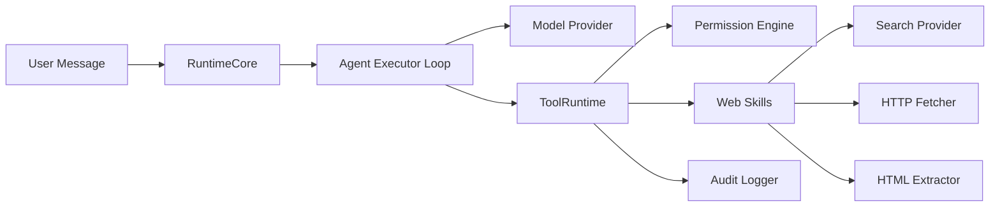
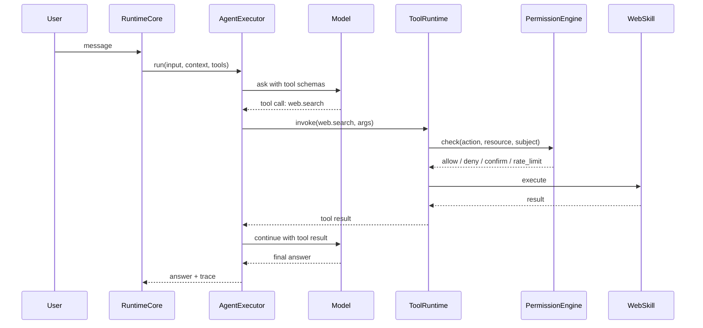

# Synapse Agent 下一迭代互联网访问能力 PRD

## 1. 背景

Synapse Runtime 已经具备 Agent 运行时、配置体系、上下文合成、工具运行时和权限模型的雏形。但当前互联网访问能力仍未形成闭环：

- Runtime 可以创建并注入 `ToolRuntime`。
- Agent 默认仍偏向纯文本调用模型。
- `ApiChatAgent` 主要是调用 OpenAI-compatible `chat/completions` 接口并返回文本。
- 工具权限中已有 `allow / confirm / deny / sandbox / rate_limit` 等语义雏形，但还没有完全落到真实执行流程。
- 当前没有默认注册的网络工具，也没有 Search → Fetch → Extract → Answer 的多步工具调用链。

因此，本迭代的目标不是“让 Agent 获得完整浏览器能力”，而是先建立一个最小但正确的联网能力底座。

---

## 2. 产品目标

本迭代的核心目标是：

> 让 Synapse Agent 能够在受控范围内访问公开互联网信息，并将搜索、抓取、抽取、引用、权限、审计纳入统一运行时治理。

具体目标分为三类。

### 2.1 能力目标

- 支持搜索公开网页信息。
- 支持抓取指定 URL 的公开内容。
- 支持从 HTML 中抽取正文、标题、发布时间等基础信息。
- 支持将工具结果提供给 Agent 继续生成回答。
- 支持在最终回答中保留来源信息。

### 2.2 平台目标

- 所有联网工具必须通过 `ToolRuntime` 注册和调用。
- 所有联网调用必须经过权限策略。
- 所有联网调用必须写入审计日志。
- 网络能力必须能通过配置一键关闭。

### 2.3 工程目标

- 对现有 RuntimeCore 和 Agent 体系最小侵入。
- 先完成 provider-agnostic 的 Agent Tool Loop。
- 原生 Web Skills 先以内置包方式实现。
- MCP / Browser / Sandbox 只预留扩展点，不进入本迭代主线。

---

## 3. 用户与使用场景

### 3.1 目标用户

本阶段主要服务两类使用者：

1. **Synapse Runtime 使用者**  
   希望 Agent 能回答需要联网的问题，例如查询文档、新闻、仓库页面、公开网页资料。

2. **Synapse Runtime 维护者**  
   希望联网能力可配置、可审计、可调试，不会让 Agent 任意访问内网、泄露凭据或产生不可控成本。

### 3.2 典型场景

| 场景                | 示例                             | 是否属于本迭代 |
| ------------------- | -------------------------------- | -------------- |
| 搜索公开信息        | “帮我查一下某个库最新文档怎么写” | 是             |
| 抓取公开 URL        | “总结这个网页”                   | 是             |
| 抽取网页正文        | “把这篇文章提炼成要点”           | 是             |
| 带来源回答          | “告诉我结论并附来源”             | 是             |
| 访问登录后页面      | “帮我看我后台的数据”             | 否             |
| 自动点击网页        | “打开网页点按钮下单”             | 否             |
| 下载文件并执行      | “下载脚本然后运行”               | 否             |
| 使用外部 MCP server | “接入 Playwright MCP”            | 后续阶段       |
| 浏览器截图取证      | “打开网页截图”                   | 后续阶段       |

---

## 4. 本迭代范围

### 4.1 必须交付

| 模块                | 说明                                                        |
| ------------------- | ----------------------------------------------------------- |
| Agent Tool Loop     | 支持模型提出工具调用、运行时执行工具、模型继续生成回答      |
| `web.search`        | 搜索公开互联网信息，返回结构化搜索结果                      |
| `web.fetch`         | 只读抓取公开 URL，支持 GET / HEAD                           |
| `web.extract`       | 从 HTML 中抽取正文、标题、发布时间、canonical URL           |
| Permission 执行语义 | 至少完成 `allow / deny / confirm / rate_limit` 的可观测行为 |
| SSRF 防护           | 拦截内网、回环、metadata、危险 scheme、危险重定向           |
| 审计日志            | 每次联网调用产生结构化审计事件                              |
| 配置开关            | 可通过配置关闭全部网络能力或关闭单个工具                    |
| 基础测试            | 覆盖工具链路、安全拦截、失败降级、审计完整性                |

### 4.2 可选交付

| 模块          | 说明                                          |
| ------------- | --------------------------------------------- |
| 搜索结果缓存  | 可以先做内存缓存，后续再持久化                |
| HTML 抽取优化 | MVP 只保证常规文章页可用                      |
| 管理端统计    | 先输出 API / 日志，TUI 或 Admin UI 可后续增强 |
| 引用格式增强  | 先输出 URL 与标题，后续再做 citation id 管理  |

### 4.3 明确不做

| 不做项               | 原因                                 |
| -------------------- | ------------------------------------ |
| 登录态网页访问       | 涉及 Cookie、凭据、隐私与授权边界    |
| POST / PUT / DELETE  | 本阶段只做只读网络能力               |
| 浏览器自动化         | 成本高、风险高，不适合作为第一阶段   |
| 任意 JS 执行         | 等价高权限执行能力，应默认禁止       |
| 本地 MCP server 启动 | 涉及本地命令执行和供应链风险         |
| 远程沙箱平台         | 平台复杂度过高，作为长期演进         |
| 多租户企业级权限系统 | 当前先满足 workspace / user 基础隔离 |

---

## 5. 成功指标

本迭代验收不以“实现了多少方案”为标准，而以联网闭环是否可靠为标准。

### 5.1 功能指标

1. 在启用网络能力后，Agent 可以完成：
   - Search → Answer
   - Fetch → Extract → Answer
   - Search → Fetch → Extract → Answer

2. 对需要联网的问题，Agent 至少能在一次工具调用成功后生成有来源的回答。

3. 当工具被拒绝、限流、超时或失败时，Agent 能给出可解释的降级反馈。

### 5.2 安全指标

1. 访问以下地址必须失败：
   - `127.0.0.1`
   - `localhost`
   - RFC1918 私网地址
   - link-local 地址
   - cloud metadata 地址
   - `file:`
   - `data:`
   - `gopher:`
   - `ftp:`

2. 重定向到危险地址时必须重新校验并阻断。

3. 不允许模型设置认证类请求头，例如：
   - `Authorization`
   - `Cookie`
   - `X-Api-Key`

4. 审计日志完整率必须为 100%。

### 5.3 性能指标

MVP 阶段建议目标：

| 指标                        | 目标                   |
| --------------------------- | ---------------------- |
| `web.search` P95            | ≤ 3s，不含模型生成时间 |
| `web.fetch` P95             | ≤ 5s，不含模型生成时间 |
| 单次 run 最大联网工具调用数 | 默认 4 次              |
| 单个 URL 最大响应体         | 默认 1MB，可配置       |
| 单 user 并发联网工具调用    | 默认 2 个              |

---

## 6. 总体架构

推荐架构如下：



核心原则：

1. **Agent 不直接访问网络**  
   所有网络访问必须通过 `ToolRuntime`。

2. **工具不绕过权限**  
   每一次 Search / Fetch / Extract 都要先进入 Permission Engine。

3. **权限不只返回布尔值**  
   权限结果应表达 `allow / deny / confirm / rate_limit / sandbox` 等状态。

4. **外部内容不直接成为系统指令**  
   网页正文只能作为 tool result 输入模型，不能拼进 system prompt。

5. **MCP 和 Browser 是后续 provider**  
   本迭代只要把工具接口和执行循环设计成可扩展即可。

---

## 7. Agent Tool Loop 设计

### 7.1 当前问题

当前 `ApiChatAgent` 更像一次性文本补全：

```text
user input -> model -> text answer
```

联网 Agent 需要变成：

```text
user input
  -> model plans tool call
  -> runtime executes tool
  -> model observes result
  -> maybe calls another tool
  -> final answer
```

因此需要新增一个 provider-agnostic 的执行器，而不是把工具逻辑硬编码进某个模型 provider。

### 7.2 推荐流程



### 7.3 执行限制

为避免工具风暴，MVP 阶段建议：

| 限制项                 | 默认值 |
| ---------------------- | ------ |
| 单轮最大 tool step     | 4      |
| 单轮最大 `web.search`  | 2      |
| 单轮最大 `web.fetch`   | 3      |
| 单轮最大 `web.extract` | 3      |
| 单个工具超时           | 8s     |
| 总工具执行预算         | 20s    |

超过限制后，Executor 应停止继续调用工具，让模型基于已有信息回答，并说明信息可能不完整。

---

## 8. Web Skills 设计

本迭代新增一个内置工具包：

```text
packages/tool-web
```

也可以命名为：

```text
packages/skills-web
```

推荐先使用 `tool-web`，因为当前能力更接近运行时工具，而不是完整插件生态。

### 8.1 工具列表

| 工具             | 作用                              | MVP  |
| ---------------- | --------------------------------- | ---- |
| `web.search`     | 搜索网页并返回候选来源            | 必须 |
| `web.fetch`      | 抓取指定 URL 的原始内容或文本摘录 | 必须 |
| `web.extract`    | 从 HTML 中抽取正文和元信息        | 必须 |
| `web.open`       | 浏览器打开页面                    | 不做 |
| `web.screenshot` | 页面截图                          | 不做 |
| `web.click`      | 页面交互                          | 不做 |

---

## 9. `web.search`

### 9.1 输入

| 字段            | 类型     | 必填 | 说明                              |
| --------------- | -------- | ---- | --------------------------------- |
| `query`         | string   | 是   | 搜索关键词                        |
| `freshness`     | enum     | 否   | `any / day / week / month / year` |
| `maxResults`    | number   | 否   | 默认 5，最大 10                   |
| `siteAllowlist` | string[] | 否   | 限定搜索域名                      |

### 9.2 输出

| 字段                    | 说明               |
| ----------------------- | ------------------ |
| `query`                 | 原始查询           |
| `searchedAt`            | 搜索时间           |
| `provider`              | 搜索 provider      |
| `results`               | 搜索结果数组       |
| `results[].title`       | 标题               |
| `results[].url`         | URL                |
| `results[].domain`      | 域名               |
| `results[].snippet`     | 摘要               |
| `results[].publishedAt` | 发布时间，可能为空 |
| `results[].sourceRank`  | 排名               |
| `results[].citationId`  | 内部引用 ID        |

### 9.3 Provider 抽象

不要把搜索供应商写死。建议定义：

```text
SearchProvider
  - name
  - search(query, options): SearchResult[]
```

MVP 只需要实现一个 provider。后续可以继续扩展：

- Brave Search
- SerpAPI
- Bing Search
- 自建 SearXNG
- 企业内部搜索

### 9.4 降级策略

| 失败情况        | 降级                                |
| --------------- | ----------------------------------- |
| provider 超时   | 返回工具错误，让 Agent 说明搜索超时 |
| provider 429    | 提示限流，可建议用户稍后重试        |
| provider 未配置 | 仅允许 `web.fetch` 处理用户显式 URL |
| 无结果          | 返回空结果，不应编造来源            |

---

## 10. `web.fetch`

### 10.1 输入

| 字段              | 类型    | 必填 | 说明              |
| ----------------- | ------- | ---- | ----------------- |
| `url`             | string  | 是   | 目标 URL          |
| `method`          | enum    | 否   | 只允许 GET / HEAD |
| `accept`          | string  | 否   | 期望内容类型      |
| `maxBytes`        | number  | 否   | 默认 1MB          |
| `timeoutMs`       | number  | 否   | 默认 8s           |
| `followRedirects` | boolean | 否   | 默认 true         |

### 10.2 输出

| 字段          | 说明                               |
| ------------- | ---------------------------------- |
| `status`      | HTTP 状态码                        |
| `url`         | 初始 URL                           |
| `finalUrl`    | 重定向后的最终 URL                 |
| `fetchedAt`   | 抓取时间                           |
| `contentType` | 响应类型                           |
| `title`       | 若可解析则返回标题                 |
| `textExcerpt` | 文本摘录                           |
| `bodyRef`     | 大正文的内部引用，不直接塞满上下文 |
| `cacheHit`    | 是否命中缓存                       |
| `truncated`   | 是否截断                           |

### 10.3 URL 安全校验

`web.fetch` 必须经过以下校验：

1. URL parse。
2. scheme allowlist。
3. hostname 规范化。
4. DNS 解析。
5. IP 地址分类校验。
6. 权限策略校验。
7. 发起请求。
8. 若发生重定向，对新 URL 重新执行 1–6。
9. 响应大小限制。
10. 输出脱敏与审计。

必须拦截：

- loopback
- private IP
- link-local
- multicast
- metadata IP
- `file:`
- `data:`
- `ftp:`
- `gopher:`
- 未知 scheme

### 10.4 Header 策略

MVP 阶段只允许运行时设置安全 header。

禁止模型或用户直接传入：

- `Authorization`
- `Cookie`
- `Proxy-Authorization`
- `X-Api-Key`
- `X-Forwarded-For`
- 任意自定义认证头

---

## 11. `web.extract`

### 11.1 输入

| 字段       | 类型   | 必填 | 说明                        |
| ---------- | ------ | ---- | --------------------------- |
| `url`      | string | 是   | 来源 URL                    |
| `htmlRef`  | string | 否   | 来自 `web.fetch` 的正文引用 |
| `maxChars` | number | 否   | 默认 6000                   |

### 11.2 输出

| 字段               | 说明               |
| ------------------ | ------------------ |
| `url`              | 来源 URL           |
| `canonicalUrl`     | canonical URL      |
| `title`            | 标题               |
| `author`           | 作者，可能为空     |
| `publishedAt`      | 发布时间，可能为空 |
| `extractedAt`      | 抽取时间           |
| `text`             | 正文               |
| `truncated`        | 是否截断           |
| `extractorVersion` | 抽取器版本         |
| `citationId`       | 引用 ID            |

### 11.3 抽取策略

MVP 可以先采用简单策略：

1. 解析 `<title>`。
2. 解析 `meta[property="og:title"]`。
3. 解析 `article` 标签。
4. 回退到主要正文容器。
5. 移除 script、style、nav、footer、aside。
6. 合并段落文本。
7. 限制最大字符数。

后续再引入更成熟的 Readability 算法。

---

## 12. 权限模型

### 12.1 权限请求结构

建议联网工具统一生成权限请求：

| 字段                  | 说明                                                   |
| --------------------- | ------------------------------------------------------ |
| `action`              | `network.search` / `network.fetch` / `network.extract` |
| `resource`            | 域名、URL、provider 或工具名                           |
| `subject.userId`      | 用户                                                   |
| `subject.workspaceId` | 工作区                                                 |
| `subject.channelId`   | 会话或频道                                             |
| `metadata`            | method、domain、contentType、estimatedBytes 等         |

### 12.2 权限决策

| 决策         | 执行语义                             |
| ------------ | ------------------------------------ |
| `allow`      | 直接执行                             |
| `deny`       | 阻断并返回可解释原因                 |
| `confirm`    | 等待用户确认，确认后继续             |
| `rate_limit` | 进入队列或返回限流错误               |
| `sandbox`    | MVP 可先返回“不支持”，后续接沙箱执行 |

MVP 中，`sandbox` 可以先不真正实现，但不能静默当作 `allow`。它应该返回明确错误：

```text
当前工具需要 sandbox 执行，但本运行时尚未启用 sandbox worker。
```

### 12.3 默认策略

建议默认：

```text
network.enabled = false
```

启用后仍默认 deny，只有显式配置 allowlist 后才能访问。

示例策略：

```toml
[network]
enabled = true

[network.tools]
search = true
fetch = true
extract = true

[network.policy]
default = "deny"
allowDomains = ["github.com", "docs.github.com", "developer.mozilla.org"]
denyPrivateNetworks = true
requireConfirmForUnknownDomains = true
```

---

## 13. 审计日志

每次联网调用都必须产生审计事件。

### 13.1 审计字段

| 字段             | 说明                                                   |
| ---------------- | ------------------------------------------------------ |
| `eventType`      | `network.search` / `network.fetch` / `network.extract` |
| `timestamp`      | 时间                                                   |
| `runId`          | 当前 Agent run                                         |
| `sessionId`      | 会话                                                   |
| `userId`         | 用户                                                   |
| `workspaceId`    | 工作区                                                 |
| `toolName`       | 工具名                                                 |
| `domain`         | 目标域名                                               |
| `urlHash`        | URL hash，避免日志泄露完整敏感参数                     |
| `policyDecision` | 权限决策                                               |
| `status`         | success / blocked / failed / timeout                   |
| `latencyMs`      | 耗时                                                   |
| `bytesIn`        | 响应大小                                               |
| `cacheHit`       | 是否缓存命中                                           |
| `errorCode`      | 错误码                                                 |

### 13.2 错误码建议

| 错误码                   | 说明                |
| ------------------------ | ------------------- |
| `NETWORK_DISABLED`       | 网络能力未启用      |
| `TOOL_DISABLED`          | 工具未启用          |
| `POLICY_DENIED`          | 权限策略拒绝        |
| `CONFIRM_REQUIRED`       | 需要用户确认        |
| `RATE_LIMITED`           | 限流                |
| `INVALID_URL`            | URL 格式错误        |
| `SCHEME_DENIED`          | scheme 被拒绝       |
| `PRIVATE_IP_DENIED`      | 私网地址被拒绝      |
| `METADATA_IP_DENIED`     | metadata 地址被拒绝 |
| `REDIRECT_TARGET_DENIED` | 重定向目标被拒绝    |
| `FETCH_TIMEOUT`          | 抓取超时            |
| `RESPONSE_TOO_LARGE`     | 响应过大            |
| `PROVIDER_ERROR`         | 搜索 provider 错误  |

---

## 14. 缓存策略

MVP 可以采用内存缓存，后续再迁移到 SQLite 或 Redis。

### 14.1 缓存对象

| 对象            | TTL     |
| --------------- | ------- |
| 搜索结果        | 5 分钟  |
| HTML fetch 结果 | 30 分钟 |
| extract 结果    | 30 分钟 |
| 失败结果        | 30 秒   |

### 14.2 缓存 key

建议：

```text
tenantId + workspaceId + toolName + normalizedUrl/query + provider + extractorVersion
```

注意：

- 缓存必须按 workspace 隔离。
- 不能把需要确认的未知域名结果缓存给其他用户绕过权限。
- 如果未来接入登录态，登录态内容必须独立 cache scope，且默认不缓存。

---

## 15. 引用与来源

MVP 不需要做复杂 citation 系统，但必须保证回答可追溯。

### 15.1 最小要求

Agent 最终回答中，若使用外部事实，应包含：

- 来源标题
- 来源 URL
- 抓取或搜索时间

示例：

```text
来源：
1. GitHub Docs - https://docs.github.com/...（抓取于 2026-07-11 13:20）
```

### 15.2 后续增强

后续可以引入：

- `citationId`
- 来源去重
- 引用片段定位
- 快照保存
- answer span 到 source span 的映射

---

## 16. 配置设计

建议在运行时配置中新增：

```toml
[network]
enabled = false
maxToolSteps = 4
totalTimeoutMs = 20000

[network.tools]
search = false
fetch = false
extract = false

[network.policy]
default = "deny"
allowDomains = []
denyDomains = []
denyPrivateNetworks = true
requireConfirmForUnknownDomains = true

[network.fetch]
timeoutMs = 8000
maxBytes = 1048576
followRedirects = true

[network.search]
provider = "none"
maxResults = 5
timeoutMs = 3000

[network.cache]
enabled = true
searchTtlSeconds = 300
fetchTtlSeconds = 1800
extractTtlSeconds = 1800
```

注意：配置里的 `provider = "none"` 表示未配置搜索供应商。此时 Agent 只能处理用户显式给出的 URL，不能主动搜索。

---

## 17. 实施顺序

本迭代建议拆成 3 个 PR。

### PR-1：Agent Tool Loop + 权限状态机

目标：先让 Agent 能调用工具，即使工具只是 mock。

交付：

- 新增 Agent Executor Loop。
- 支持模型请求工具调用。
- 支持工具结果回传模型。
- 支持最大 tool step 限制。
- Permission Engine 返回结构化决策。
- `allow / deny / confirm / rate_limit / sandbox` 有明确执行语义。
- 加入 runId / traceId。

验收：

- mock 工具可以被模型调用。
- 工具失败后模型能继续生成降级回答。
- 非 allow 状态不会被静默放行。
- 单轮超过最大 tool step 会停止。

### PR-2：原生 Web Skills

目标：实现只读 Web 能力。

交付：

- `web.search`
- `web.fetch`
- `web.extract`
- URL 安全校验
- 重定向逐跳校验
- 响应大小限制
- 超时与重试
- 基础缓存

验收：

- 可以完成 Search → Fetch → Extract。
- 可以总结用户提供的公开 URL。
- 私网、metadata、危险 scheme 全部被阻断。
- 搜索 provider 未配置时，系统能明确提示。

### PR-3：审计、配置、测试与文档

目标：让能力可上线、可回滚、可排查。

交付：

- `network.enabled` 总开关。
- 工具级开关。
- allowlist / denylist。
- 审计日志。
- 错误码。
- 测试用例。
- README / PRD 文档更新。

验收：

- 关闭 `network.enabled` 后所有联网工具不可用。
- 所有联网动作都有审计事件。
- 安全测试覆盖关键 SSRF 场景。
- 文档包含启用方式、风险说明、配置示例。

---

## 18. 测试计划

### 18.1 单元测试

| 测试项           | 示例                                              |
| ---------------- | ------------------------------------------------- |
| URL parse        | 非法 URL、空 URL、编码绕过                        |
| scheme allowlist | `file:` / `data:` / `ftp:` 被拒绝                 |
| IP 分类          | `127.0.0.1`、`10.0.0.1`、`169.254.169.254` 被拒绝 |
| 重定向校验       | 公开 URL 302 到内网时被拒绝                       |
| 权限状态机       | allow / deny / confirm / rate_limit / sandbox     |
| 缓存 key         | workspace 隔离                                    |
| 响应截断         | 超过 maxBytes 后截断                              |

### 18.2 集成测试

| 测试项                            | 预期                         |
| --------------------------------- | ---------------------------- |
| Search → Answer                   | Agent 使用搜索结果回答       |
| Fetch → Extract → Answer          | Agent 总结 URL 内容          |
| Search → Fetch → Extract → Answer | Agent 基于搜索结果进一步抓取 |
| provider 未配置                   | 返回明确错误                 |
| 工具超时                          | Agent 降级说明               |
| 工具被拒绝                        | Agent 解释为什么无法访问     |

### 18.3 安全测试

| 用例                                      | 预期       |
| ----------------------------------------- | ---------- |
| `http://127.0.0.1:3000`                   | 阻断       |
| `http://localhost:3000`                   | 阻断       |
| `http://169.254.169.254/latest/meta-data` | 阻断       |
| `file:///etc/passwd`                      | 阻断       |
| 公开 URL 重定向到私网                     | 阻断       |
| 用户要求带 Cookie 抓取                    | 拒绝       |
| 用户要求设置 Authorization                | 拒绝       |
| 大响应体                                  | 截断或失败 |

---

## 19. 验收标准

### 19.1 MVP 验收

本迭代完成时，应满足：

1. Agent 能完成至少 2 轮工具调用。
2. `web.search` / `web.fetch` / `web.extract` 可通过 `ToolRuntime` 调用。
3. 所有联网调用都经过权限决策。
4. 所有联网调用都有审计事件。
5. `network.enabled=false` 时无法访问网络。
6. 私网、metadata、危险 scheme、危险重定向全部被阻断。
7. 搜索 provider 未配置时，系统不会假装搜索成功。
8. 工具失败后，Agent 能给出可解释反馈。
9. README 中说明如何启用、配置和排查。
10. 安全测试用例全部通过。

### 19.2 不算验收失败的情况

以下情况不应阻塞 MVP：

- HTML 抽取质量不完美。
- 搜索结果排序不够好。
- 不支持登录态页面。
- 不支持浏览器截图。
- 不支持 MCP。
- 不支持沙箱 worker。
- 不支持 POST / 表单提交。
- 不支持复杂 citation span 映射。

---

## 20. 风险与应对

| 风险                 | 影响           | 应对                                                                   |
| -------------------- | -------------- | ---------------------------------------------------------------------- |
| 工具循环导致无限调用 | 成本与延迟失控 | 限制 maxToolSteps 和总超时                                             |
| SSRF 绕过            | 高安全风险     | URL、DNS、IP、重定向逐层校验                                           |
| 搜索 provider 不稳定 | 回答失败       | provider 抽象 + 明确错误 + 缓存                                        |
| 抽取质量差           | 回答质量下降   | 先满足常规文章页，后续优化                                             |
| 权限语义复杂         | 实现延期       | MVP 先完成 allow / deny / confirm / rate_limit，sandbox 返回明确不支持 |
| 日志泄露 URL 参数    | 隐私风险       | URL hash + 参数脱敏                                                    |
| 引用不准确           | 用户信任下降   | 最终回答强制带来源 URL 和抓取时间                                      |
| 一次迭代过大         | 难以完成       | MCP / Browser / Sandbox 后移                                           |

---

## 21. 后续演进 Backlog

### 21.1 Phase 2：MCP Gateway

目标：把外部 MCP server 映射为 Synapse 工具。

范围：

- MCP server registry
- stdio / Streamable HTTP transport
- tool schema mirror
- OAuth / scope 管理
- 本地二次权限校验
- MCP 工具审计

不进入当前 MVP。

### 21.2 Phase 3：Browser Service

目标：处理 JS-heavy 页面、截图、复杂交互。

范围：

- 独立 browser-service
- 临时 browser profile
- 导航、快照、截图
- 点击、输入等有限动作
- 禁止任意 JS 执行
- 域名 allowlist
- trace 与审计

不进入当前 MVP。

### 21.3 Phase 4：Sandbox Worker

目标：让高风险工具运行在隔离环境。

范围：

- gVisor / Firecracker 调研
- egress policy
- worker broker
- 运行时安全监控
- 高风险 MCP server 隔离

不进入当前 MVP。
