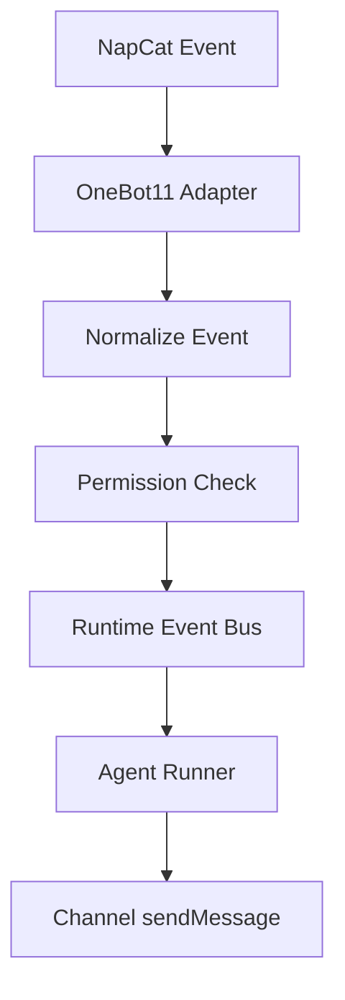
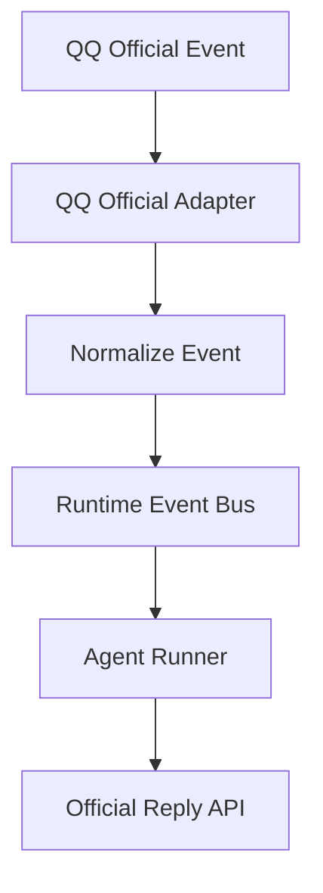

# Synapse Runtime QQ 渠道适配 PRD

版本：v0.1  
状态：草案  
技术栈：JavaScript / TypeScript / Node.js  
开发方式：敏捷迭代  

## 1. 背景

Synapse Runtime 的定位不是传统部署后台，而是一个可独立运行的 Agent Infra Runtime。它需要支持多种外部渠道接入，例如移动端、CLI、HTTP API、Webhook、QQ、Telegram 等。

在 QQ 渠道上，目前有两类可选接口：

1. QQ 官方 Bot API：适合公开服务、合规机器人、长期运营。
2. NapCat / OneBot 11：适合个人部署、本地节点、私有 Agent、快速开发验证。

两者的能力、合规性、部署方式和风险边界不同。因此 Synapse Runtime 不应直接绑定某一个 QQ 实现，而应设计统一的 Channel Adapter 抽象，在内部屏蔽官方 Bot 和 NapCat 的差异。

## 2. 产品目标

### 2.1 核心目标

构建 Synapse Runtime 的 QQ 渠道适配能力，使 Runtime 可以通过统一接口接入 QQ 官方 Bot 和 NapCat / OneBot 11。

目标结果：

- Runtime 可以独立运行 QQ Agent。
- 个人部署优先支持 NapCat。
- 对外服务优先支持 QQ 官方 Bot。
- 内部 Agent 不感知底层渠道差异。
- 后续可以扩展 Telegram、Discord、微信、邮件等渠道。

### 2.2 非目标

本阶段不做：

- QQ 插件市场。
- 多平台统一运营后台。
- 大规模 SaaS 托管。
- 完整计费系统。
- 对 NapCat 的账号风控规避能力。
- 绕过官方平台限制的能力。

## 3. 用户角色

| 角色 | 说明 | 核心诉求 |
|---|---|---|
| 个人部署用户 | 在自己电脑、VPS、NAS 上运行 Synapse Runtime | 快速接入 QQ，私有化使用 Agent |
| Agent 开发者 | 编写 Agent、工具、插件的人 | 不关心 QQ 官方和 NapCat 差异 |
| 平台维护者 | 后续维护 Synapse Server 或 Hosted Runtime 的人 | 接口合规、可观测、可限制风险 |
| 群聊用户 | 在 QQ 群里与 Agent 交互的人 | 响应稳定、不会刷屏、能处理上下文 |

## 4. 产品原则

### 4.1 Runtime 独立原则

QQ 渠道适配应运行在 Synapse Runtime 内部，不依赖 Synapse Mobile 或 Synapse Server。

Runtime 应支持：

```bash
synapse-runtime start
synapse-runtime channel add qq-local
synapse-runtime agent run study-agent
```

### 4.2 Adapter 统一原则

Runtime 内部只识别统一的 Channel Adapter 接口。

不允许 Agent 直接依赖：

- QQ 官方 Bot SDK。
- NapCat API。
- OneBot 事件原始结构。
- 特定 QQ 消息段格式。

### 4.3 模式区分原则

不同运行模式使用不同默认策略：

| 运行模式 | 默认 QQ 适配器 | 说明 |
|---|---|---|
| Local Mode | NapCat / OneBot 11 | 个人部署，开发友好，能力完整 |
| Attached Mode | NapCat 或官方 Bot | 用户自有 Runtime 接入云端 |
| Hosted Mode | QQ 官方 Bot | 平台托管，合规优先 |

### 4.4 权限前置原则

所有渠道动作都必须经过 Runtime Permission Engine。

例如：

- 发群消息：allow 或 confirm。
- 主动私聊：confirm。
- 踢人、禁言、撤回：confirm 或 deny。
- 大量发送消息：rate limit。
- 调用外部 API：sandbox 或 confirm。

## 5. 需求范围

### 5.1 第一阶段范围

第一阶段实现 OneBot 11 Adapter，优先适配 NapCat。

需要支持：

- WebSocket 连接。
- HTTP API 调用。
- 接收私聊消息。
- 接收群聊消息。
- 发送私聊消息。
- 发送群聊消息。
- 基础消息段解析。
- 文本、图片消息的统一模型。
- 事件转发给 Runtime Event Bus。
- Agent 回复流式或最终结果发送。
- 基础限流。
- 基础日志。

### 5.2 第二阶段范围

第二阶段实现 QQ Official Adapter。

需要支持：

- AppID / AppSecret 配置。
- Webhook 或官方推荐接收模式。
- 群聊 @ 消息。
- C2C 私聊消息。
- 频道消息。
- 图片、文件等媒体能力。
- 官方错误码处理。
- 凭据安全存储。
- 沙箱环境配置。

### 5.3 第三阶段范围

第三阶段做渠道能力统一和策略调度。

需要支持：

- Channel Capability 探测。
- 多 QQ 渠道实例。
- 渠道优先级。
- 消息路由规则。
- 风险级别标记。
- Adapter 健康检查。
- Channel Trace。
- 管理 API。

## 6. 功能需求

### 6.1 Channel Adapter 抽象

系统必须定义统一接口：

```ts
export interface ChannelAdapter {
  id: string
  type: string
  provider: string

  connect(): Promise<void>
  disconnect(): Promise<void>
  getStatus(): Promise<ChannelStatus>
  getCapabilities(): ChannelCapabilities

  sendMessage(target: ChannelTarget, message: SynapseMessage): Promise<SendResult>
  onEvent(handler: ChannelEventHandler): void
}
```

### 6.2 统一消息模型

内部统一消息结构：

```ts
export interface SynapseMessage {
  id?: string
  type: "text" | "image" | "file" | "audio" | "video" | "mixed"
  segments: MessageSegment[]
  raw?: unknown
}

export type MessageSegment =
  | { type: "text"; text: string }
  | { type: "image"; url?: string; fileId?: string; localPath?: string }
  | { type: "file"; name: string; url?: string; fileId?: string }
```

### 6.3 统一事件模型

内部统一事件结构：

```ts
export interface SynapseChannelEvent {
  id: string
  channelId: string
  platform: "qq"
  eventType: "message.created" | "message.deleted" | "member.joined" | "member.left" | "notice"
  conversation: ConversationRef
  sender: SenderRef
  message?: SynapseMessage
  raw: unknown
  receivedAt: string
}
```

### 6.4 能力声明

每个 Adapter 必须声明能力：

```ts
export interface ChannelCapabilities {
  receivePrivateMessage: boolean
  receiveGroupMessage: boolean
  receiveAllGroupMessages: boolean
  requiresMention: boolean
  sendPrivateMessage: boolean
  sendGroupMessage: boolean
  sendMedia: boolean
  manageGroup: boolean
  recallMessage: boolean
  complianceLevel: "official" | "community" | "unofficial"
  riskLevel: "low" | "medium" | "high"
}
```

### 6.5 配置文件

Runtime 支持 YAML 或 JSON 配置。

示例：

```yaml
channels:
  qq-local:
    adapter: onebot11
    provider: napcat
    transport: websocket
    endpoint: ws://127.0.0.1:3001
    accessToken: ${NAPCAT_TOKEN}
    enabled: true
    riskLevel: high

  qq-official:
    adapter: qq-official
    appId: ${QQ_BOT_APP_ID}
    appSecret: ${QQ_BOT_APP_SECRET}
    mode: webhook
    enabled: false
    riskLevel: low
```

### 6.6 权限策略

配置示例：

```yaml
permissions:
  channel.qq.send_group_message: allow
  channel.qq.send_private_message: confirm
  channel.qq.manage_group: deny
  channel.qq.send_media: confirm
```

策略枚举：

| 策略 | 说明 |
|---|---|
| allow | 直接允许 |
| confirm | 需要用户确认 |
| deny | 禁止 |
| sandbox | 沙箱执行 |
| rate_limit | 限流后允许 |

### 6.7 Agent 绑定渠道

Agent Manifest 可声明可用渠道：

```yaml
id: qq-study-agent
name: QQ 学习助手
channels:
  - qq-local
tools:
  - memory.search
  - task.create
  - schedule.plan
permissions:
  channel.qq.send_group_message: allow
  task.create: confirm
```

## 7. 技术方案

### 7.1 技术栈

| 层级 | 技术 |
|---|---|
| 语言 | TypeScript |
| 运行时 | Node.js 20+ |
| 包管理 | pnpm |
| Monorepo | pnpm workspace / Turborepo 可选 |
| HTTP | Fastify 或自研 nova-http |
| WebSocket | ws |
| 配置 | zod + yaml |
| 日志 | pino |
| 数据库 | SQLite |
| ORM | Drizzle ORM |
| 测试 | Vitest |
| 校验 | Zod |
| CLI | commander 或 cac |
| 事件总线 | mitt / EventEmitter / 自研 EventBus |

### 7.2 推荐包结构

```text
synapse-runtime
├─ apps
│  └─ runtime-cli
│
├─ packages
│  ├─ core
│  ├─ protocol
│  ├─ channel
│  ├─ channel-onebot11
│  ├─ channel-qq-official
│  ├─ agent
│  ├─ permission
│  ├─ config
│  ├─ logger
│  └─ shared
│
├─ examples
│  ├─ napcat-local
│  └─ qq-official
│
└─ docs
```

### 7.3 依赖方向

```text
agent -> channel interface
channel-onebot11 -> channel interface
channel-qq-official -> channel interface
runtime-core -> channel registry
server bridge -> runtime protocol
```

禁止：

```text
agent -> napcat
agent -> qq-official-sdk
runtime-core -> concrete qq adapter
```

## 8. 系统流程

### 8.1 NapCat 消息进入 Runtime



### 8.2 官方 QQ Bot 消息进入 Runtime



## 9. 敏捷开发计划

### Sprint 0：项目骨架

周期：3 到 5 天

目标：

- 建立 TypeScript monorepo。
- 建立 Runtime Core 基础结构。
- 定义 Channel Adapter 接口。
- 定义统一消息和事件模型。
- 建立 Vitest 测试环境。

验收标准：

- `pnpm test` 通过。
- 能加载一个 mock channel。
- mock channel 可以触发事件并被 Runtime 接收。

### Sprint 1：OneBot11 / NapCat MVP

周期：1 周

目标：

- 实现 OneBot11 Adapter。
- 支持 WebSocket 事件接收。
- 支持发送私聊和群聊文本消息。
- 支持基础配置。
- 接入 Runtime Event Bus。

用户故事：

```text
作为个人部署用户，
我希望通过 NapCat 接入我的 QQ，
这样我可以在 QQ 私聊或群聊中使用 Synapse Agent。
```

验收标准：

- Runtime 能连接 NapCat。
- 收到 QQ 消息后能转换为 SynapseChannelEvent。
- Agent 能返回文本回复。
- 连接失败时有明确日志。

### Sprint 2：Agent 集成与权限

周期：1 周

目标：

- 接入 Agent Runner。
- 支持 Agent Manifest 绑定渠道。
- 实现发送消息权限策略。
- 实现基础限流。
- 实现 trace 记录。

验收标准：

- Agent 可根据 QQ 消息生成回复。
- 群消息可配置是否仅响应 @ 或关键词。
- 超频发送会被限制。
- 每次事件处理都有 traceId。

### Sprint 3：QQ Official Adapter MVP

周期：1 到 2 周

目标：

- 实现 QQ 官方 Bot 配置。
- 支持官方事件接收。
- 支持群聊 @ 消息。
- 支持 C2C 私聊消息。
- 支持官方发送消息 API。

验收标准：

- 可以使用官方机器人收发文本消息。
- 官方 Adapter 能输出统一 SynapseChannelEvent。
- 官方错误码能转换为 Runtime 错误。
- 凭据不会出现在普通日志中。

### Sprint 4：多渠道管理

周期：1 周

目标：

- Channel Registry。
- 多 QQ 实例。
- Adapter 健康检查。
- Capability 探测。
- CLI 管理命令。

CLI 示例：

```bash
synapse-runtime channels list
synapse-runtime channels status qq-local
synapse-runtime channels enable qq-official
```

验收标准：

- 可以同时配置多个渠道。
- 可以查看渠道状态。
- Runtime 能根据能力选择发送策略。

### Sprint 5：稳定性与文档

周期：1 周

目标：

- 增加集成测试。
- 增加配置示例。
- 增加错误排查文档。
- 增加安全说明。
- 整理 MVP 发布文档。

验收标准：

- README 可指导用户完成 NapCat 接入。
- 文档说明官方和 NapCat 的适用边界。
- 核心模块测试覆盖主要流程。

## 10. 用户故事 Backlog

| 优先级 | 用户故事 | 验收标准 |
|---|---|---|
| P0 | 作为个人用户，我可以用 NapCat 接入 QQ | 能收发私聊和群聊文本 |
| P0 | 作为开发者，我可以用统一事件处理 QQ 消息 | Agent 不依赖 NapCat 原始事件 |
| P0 | 作为维护者，我可以配置发送权限 | 私聊、群聊、管理动作可分别限制 |
| P1 | 作为平台方，我可以接入官方 QQ Bot | 能收发官方 Bot 消息 |
| P1 | 作为用户，我可以限制群聊触发条件 | 支持 @、关键词、白名单群 |
| P1 | 作为开发者，我可以查看事件 trace | 每次消息处理有 traceId |
| P2 | 作为维护者，我可以同时运行多个 QQ 渠道 | 支持多实例和状态查看 |
| P2 | 作为用户，我可以发送图片 | 支持图片消息段 |

## 11. 风险与策略

| 风险 | 影响 | 策略 |
|---|---|---|
| NapCat 非官方实现存在账号风险 | 影响个人用户账号 | 仅作为 Local / Attached 用户自有节点能力 |
| 官方 Bot 权限受限 | 部分群聊能力不可用 | 使用 Capability 机制声明能力差异 |
| 消息刷屏 | 群体验差，账号风险 | 默认限流，群聊默认只响应 @ |
| 凭据泄露 | 严重安全问题 | 环境变量、密钥脱敏、日志过滤 |
| Adapter 差异污染 Agent | 长期架构难维护 | 强制统一事件和消息模型 |
| QQ 平台 API 变更 | 接口失效 | Adapter 独立包维护，增加集成测试 |

## 12. 安全设计

### 12.1 凭据安全

- AppSecret 和 accessToken 只能来自环境变量或本地密钥存储。
- 日志中必须脱敏。
- 配置导出时不包含明文密钥。

### 12.2 权限安全

- 群管理能力默认关闭。
- 主动私聊默认需要确认。
- 媒体发送默认需要限流。
- 插件不能绕过 Channel Adapter 直接调用底层接口。

### 12.3 运行模式限制

Hosted Mode 默认禁止 NapCat 托管。

允许：

```text
用户自己的 Runtime 使用 NapCat。
平台托管 Runtime 使用 QQ 官方 Bot。
```

不建议：

```text
平台集中托管大量 NapCat 账号。
```

## 13. 数据模型

### 13.1 ChannelInstance

```ts
interface ChannelInstance {
  id: string
  adapter: string
  provider: string
  enabled: boolean
  status: "offline" | "connecting" | "online" | "error"
  capabilities: ChannelCapabilities
  createdAt: string
  updatedAt: string
}
```

### 13.2 ChannelTrace

```ts
interface ChannelTrace {
  id: string
  channelId: string
  direction: "inbound" | "outbound"
  eventType: string
  status: "success" | "failed" | "blocked"
  error?: string
  raw?: unknown
  createdAt: string
}
```

### 13.3 PermissionDecision

```ts
interface PermissionDecision {
  action: string
  resource: string
  decision: "allow" | "confirm" | "deny" | "sandbox" | "rate_limit"
  reason?: string
}
```

## 14. API 草案

### 14.1 查看渠道

```http
GET /v1/channels
```

### 14.2 查看渠道状态

```http
GET /v1/channels/:id/status
```

### 14.3 发送消息

```http
POST /v1/channels/:id/messages
Content-Type: application/json

{
  "target": {
    "type": "group",
    "id": "123456"
  },
  "message": {
    "type": "text",
    "segments": [
      { "type": "text", "text": "你好" }
    ]
  }
}
```

### 14.4 渠道事件流

```http
GET /v1/channels/:id/events
Accept: text/event-stream
```

## 15. MVP 验收标准

MVP 完成后应满足：

- 可以独立启动 Synapse Runtime。
- 可以通过配置连接 NapCat。
- 可以接收 QQ 私聊和群聊文本消息。
- 可以把 QQ 消息转换为统一事件。
- Agent 可以处理事件并返回文本。
- 发送消息经过权限和限流。
- 日志中能查看事件、发送、错误。
- 代码结构允许继续加入 QQ 官方 Bot Adapter。

## 16. 后续演进

### 16.1 多平台渠道

后续可以扩展：

- Telegram。
- Discord。
- Slack。
- 邮件。
- Webhook。
- 移动端节点。

### 16.2 插件化渠道

渠道本身可以作为 Runtime Plugin：

```yaml
id: channel-onebot11
type: channel
entry: ./dist/index.js
permissions:
  - network.ws
  - network.http
```

### 16.3 Server Bridge

当 Runtime 接入 Synapse Server 后，Server 只负责：

- Runtime 注册。
- 远程调用。
- Token 签发。
- 状态查看。
- Relay。

Server 不直接处理 NapCat 账号，也不接管用户本地 QQ 凭据。

## 17. 总结

QQ 官方 Bot 和 NapCat 不应被视为二选一。

Synapse Runtime 的正确设计是：

```text
内部统一 Channel Adapter
个人部署优先 NapCat / OneBot 11
对外服务优先 QQ 官方 Bot
Agent 只依赖统一消息和事件模型
权限、限流、日志、trace 由 Runtime 统一管理
```

第一版应优先实现 OneBot11 / NapCat Adapter，以便快速验证 Runtime 的 Agent 渠道模型。第二版补齐 QQ Official Adapter，为未来公开服务和 Hosted Mode 做准备。
